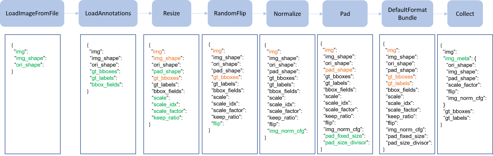

<div align="center">
  
  <div>&nbsp;</div>
</div>

<div align="center">

English | [简体中文](README_zh-CN.md)

</div>

## 📖 Contents
- [Introduction](#Introduction)
- [News](#News)
- [Installation](#Installation)
- [Dataset](#Dataset)
- [Model](#model)
- [Usage](#usage)
- [Demo](#Demo)
- [Notes](#Notes)
- [Acknowledgements](#Acknowledgements)
- [License](#License)

## Introduction
[CrashEye](https://github.com/YanJieWen/CrashEye) is an intelligent perception and trajectory interpolation framework for train collision sequence images.  
It aims to bridge the gap between real-world train collision experiments and finite element simulation models, enabling accurate reproduction and prediction of collision dynamics.  
The master branch code currently supports on `Pytorch 2.0` `Python 3.8` and `CUDA11.8`. 

**🔥Hightlights**
- **Integrating Multiple Detection/Tracking Architectures**:

 CrashEye integrates detectors including [MMdetection](https://github.com/open-mmlab/mmdetection)/[ultralytics](https://github.com/ultralytics/ultralytics)/strong baseline [CVMR](https://github.com/YanJieWen/CVMR). Trackers include [MMTracking](https://github.com/open-mmlab/mmtracking)) and a strong baseline [MASORT](https://github.com/YanJieWen/MASORT). Furthermore, our strong baseline includes a self-supervised Re-ID module [LWTGPF](https://github.com/YanJieWen/LWTGPF-2025). Developers can combine several components and modules to create customized models.
- **Multi-scenes adaptability** 

CrashEye is effective in multi-source collision scenarios, including absorber crash, full-train crash, and scaled train collisions.
<div align="center">
  


</div>  

- **High efficiency**

All operations (detection/tracking) are performed on a powerful GPU (RTX4090@24G).
Leveraging the existing data processing pipeline, there is no need to directly process the high-resolution images captured by the high-speed shot camera (HS2C); instead, memory consumption is significantly reduced through image downscaling.
<div align="center">  

   

</div>


- **High performance**

CrashEye includes a strong baseline model that integrates [CVMR](https://github.com/YanJieWen/CVMR) for small object detection, [LWTGPF](https://github.com/YanJieWen/LWTGPF-2025) for deep   instance appearance feature extraction, and [MASORT](https://github.com/YanJieWen/MASORT) for adaptive cross-frame tracking. The performance of each baseline is reported in correspond repository. 

## News  
- **⭐2025-09-08**

  - Initial release of CrashEye, supporting autonomous perception of train collision sequence images.

  - Released dataset interfaces: Crash2024, Crash-ReID, and Crash-Seq.

  - Provided pretrained weights for various models, including detection and Re-ID.

- **⭐2025-09-14**
  - Release the English version of the [instructions](README.md)

## Installation 

### 1. CrashEye

``` shell
git clone  https://github.com/YanJieWen/CrashEye.git
cd CrashEye
python setup.py develop
```
### 2. [openmmlab](https://mmdetection.readthedocs.io/zh-cn/latest/get_started.html) baslines  

``` shell
pip install -U openmim
mim install mmengine
```

- **Install mmcv**

Version of mmdet and mmcv shoudle be aligen, [Reference](https://github.com/open-mmlab/mmtracking/blob/master/docs/zh_cn/install.md)。Installing [mmcv](https://github.com/open-mmlab/mmcv) through wheel, Refernce list is [here](https://download.openmmlab.com/mmcv/dist/cu118/torch2.0/index.html)  
[](https://drive.google.com/drive/folders/1pAr4dmMDkEW2Wvl4af2sknU2GPN2856S?usp=sharing)
```shell
shell mim install mmcv_full-1.7.2-cp38-cp38-manylinux1_x86_64.whl
```
- **Install mmdetection**

```shell
cd modeling
cd mmdetection
%git checkout tags/v2.28.0
pip install -v -e .
python setup.py install
cd ..
```
- **Install mmtracking**

```shell
git clone https://github.com/open-mmlab/mmtracking.git
cd mmtracking git checkout tags/v0.14.0
pip install -v -e .
python setup.py install
cd ..
```

### 3. Ultralytics  

- **Install CVMR**
```shell
git clone https://github.com/YanJieWen/CVMR.git
cd CVMR
```

- **Install [Casual Conv1D](https://github.com/Dao-AILab/causal-conv1d/releases) and [SSM](https://github.com/state-spaces/mamba/releases) operataions**

[](https://drive.google.com/drive/folders/1pAr4dmMDkEW2Wvl4af2sknU2GPN2856S?usp=sharing) [](https://drive.google.com/drive/folders/1pAr4dmMDkEW2Wvl4af2sknU2GPN2856S?usp=sharing)  

```shell
shell pip install causal_conv1d-1.4.0+cu118torch2.0cxx11abiFALSE-cp38-cp38-linux_x86_64.whl
pip install mamba_ssm-2.2.2+cu118torch2.0cxx11abiFALSE-cp38-cp38-linux_x86_64.whl pip install --upgrade pip pip install -v -e .
cd ..
```

- **Change code**

Add the forced half-precision comment in ``line 113`` of ``modeling/CVMR/ultralytics/engine/validator.py`` (training may result in Nan under certain conditions).  

### 4. MASORT and external packages

- **Install MASORT**

```shell
cd MASORT
python setup.py develop
```

- **External packages**

We can refer [MASORT](https://github.com/YanJieWen/MASORT) for more details.  

```shell
cd external git clone https://github.com/JonathonLuiten/TrackEval.git
cd TrackEval pip install -v -e .
cd ..
```

```shell
git clone https://github.com/KaiyangZhou/deep-person-reid.git
cd deep-person-reid pip install -r requirements.txt
python setup.py develop
cd ..
```
```shell
git clone https://github.com/JDAI-CV/fast-reid.git
```

### 5. Other packages

```shell
shell pip install faiss-gpu
pip install emoji
pip install openpyxl
pip install loguru
pip install thop
pip install filterpy
pip install scikit-learn
pip install grad-cam==1.4.8
pip install timm
```
## Dataset 

CrashEye createvly develop the first benchmark towards train crash scenes, which includes `Crash2024`, `Crash-Seq` and `Crash-ReID`. All data is available upon request.  

<div align="center">

| Type | Name | Download | Storage address |
| ---------- | ---------- | ----------------------- | -------------------------------------------- |
| Detection | Crash2024 | [data](https://drive.google.com/drive/folders/1BJOdywj-hgXRKt_q0TEcBGpCV4Wojmhc?usp=drive_link) | **datasets** |
| Re-ID | Crash-ReID | [data](https://pan.baidu.com/s/17e5o7nZqMTBO0WxoDDfZvA?pwd=ks5f) | **datasets**|
| Tracking | Crash-Seq | [data]( https://pan.baidu.com/s/1FyOSl3A43Cibm6zxXlGYbA?pwd=gpju) | **datasets** |

</div>  


## model

CrashEye supply 7 examples on [configs](configs), which includes pure openmmlab-based method, pure ultralytics-based method and mix method. That's to say, developer can change ``yaml`` to define model arbitrarily. ``It should be noted that a pre-trained model of the model is required:``  

<div align="center">  

| Detect | Track | Model | Config | Storage address |
| ---------- | ---------- | --------------------------------------------------------------------------- | -------------------------------------------- | -------------------------------------------- |
| Centernet | MASORT | model[[baidu:csuw]](https://pan.baidu.com/s/1YjfNrMjzZW8y4461-lIKew) | [config](configs/mix_crash_centernet_masort.yaml) | **pretrained/det** |
| YOLOv8 | Deepsort | model[[baidu:csuw]](https://pan.baidu.com/s/1YjfNrMjzZW8y4461-lIKew) | [config](configs/mix_crash_yolov8s_deepsort.yaml) | **pretrained/det** |
| Centernet | Deepsort | model[[baidu:csuw]](https://pan.baidu.com/s/1YjfNrMjzZW8y4461-lIKew) | [config](configs/mm_crash_centernet.yaml) |**pretrained/det** |
| Faster-RCNN | Deepsort | model[[baidu:csuw]](https://pan.baidu.com/s/1YjfNrMjzZW8y4461-lIKew) | [config](configs/mm_crash_frcnn.yaml)  | **pretrained/det** |
| YOLOX | ByteTrack | model[[baidu:csuw]](https://pan.baidu.com/s/1YjfNrMjzZW8y4461-lIKew) | [config](configs/mm_crash_yolox.yaml)  | **pretrained/det** |
| CVMR | MASORT | model[[baidu:csuw]](https://pan.baidu.com/s/1YjfNrMjzZW8y4461-lIKew) | [config](configs/ult_crash_cvmrs.yaml)  | **pretrained/det** |
| YOLOv8s | MASORT | model[[baidu:csuw]](https://pan.baidu.com/s/1YjfNrMjzZW8y4461-lIKew)| [config](ult_crash_yolov8.yaml)  |  **pretrained/det** |

</div>  

Moreover，CrashEye also supply the Re-ID pre-trained models towards person and crash scene:  

<div align="center">  
  
| Dataset | Model | Storage address |
| ---------- | ---------------------------------------------------------------------------| ---------------------------  |
| MOT17-val | model[[baidu:csuw]](https://pan.baidu.com/s/1Mhbw2E4KPvz704OaAloe5A) | **pretrained/reid** |
| MOT17-test | model[[baidu:csuw]](https://pan.baidu.com/s/1Mhbw2E4KPvz704OaAloe5A) | **pretrained/reid** |
| MOT20 | model[[baidu:csuw]](https://pan.baidu.com/s/1Mhbw2E4KPvz704OaAloe5A) | **pretrained/reid** |
| DanceTrack | model[[baidu:csuw]](https://pan.baidu.com/s/1Mhbw2E4KPvz704OaAloe5A) | **pretrained/reid** |
| Crash-Seq | model[[baidu:csuw]](https://pan.baidu.com/s/1Mhbw2E4KPvz704OaAloe5A) | **pretrained/reid** |  

</div>   

## usage  

CrashEye provides a minimal example to demonstrate how to run this project. This example is derived from [CVMR+MASORT](configs/ult_crash_cvmrs.yaml).  
[](https://pan.baidu.com/s/1tltqqGCQHEANv9VeJbWs-w?pwd=4bjh) 

Rename the pre-trained weights folder `cvmr-s-1440` and place it in the `modeling/CVMR/runs` directory. 

- **Preparation**

CrashEye follows the training methods of most trackers, using a hybrid training approach. First, convert Crash-Seq to COCO format.  

```shell
python tools/convert_crash_to_coco.py
```

Before mixing the data, you may need to create a soft link to the image directory. Refer to the header of [mix](tools/mix_data_crash_ablation.py) 

```shell
python tools/mix_data_crash_ablation.py
```

For the YOLO dataset, further conversion of the COCO data may be required. Execute [code](tools/convert_coco_to_yolo.py) and move the data to the `CVMR/datasets` directory.  
```shell
python tools/convert_coco_to_yolo.py
mkdir -p modeling/CVMR/datasets/crash
```

- **Training**

```shell
python tools/ult_train.py --config configs/ult_crash_cvmrs.yaml
```

- **Evaluating**

```shell
python tools/ult_val.py --config configs/ult_crash_cvmrs.yaml
```

- **Analysis**

CrashEye can output heatmaps, COCO-formatted prediction results, and PR curves. Just run: 

```shell
python tools/ult_ana.py --config configs/ult_crash_cvmrs.yaml
```

Analysis results and log files can be seen in `runs/ult_cvmr-s_crash/analysis` 

<div align="center">  

  
<div>&nbsp;</div>  


</div>  

- **Tracking Evaluation**


```shell
python tools/track.py --config configs/ult_crash_cvmrs.yaml
```
Similarly, tracking results are saved in the `runs/ult_cvmr-s_crash/analysis` folder.  


## Demo 

Onlu one line code can acheive continuous tracking for any train crash scenes. 
```shell
python tools/demo.py -c configs/ult_crash_cvmrs.yaml -d demo/demo02.avi
```

Results are saved in `runs/ult_cvmr-s_crash/demo`. Furthermore，we also provide a linear interpolation [method](utils/interpolation.py) to fill in the track loss caused by occlusion, and the generated tracking result is named `data_dti.txt` .  


<div align="center">  
  
  
  <div>&nbsp;</div>  
  
</div>

## Notes  

- ⚠️ When calling `TrackEval` to evaluate HOTA, the ``numpy`` version may be incorrect. Numpy needs to be updated.

- ⚠️ When building a new model based on mmdetection, you need to recompile ``python setup.py install``.

- ⚠️ The model training resolution is 800x1440. Developers need to carefully adjust the resolution to ensure optimal results.

- ⚠️ For **MASORT**, the `alpha_gate` and `appear_thresh` parameters may need to be carefully adjusted to achieve optimal tracking results.

- ⚠️ The strong baseline provided by CrashEye has the potential to address both long-range high-frame-rate HS2C and close-range low-frame-rate HS2C, but it cannot address the dual challenges of long-range low-frame-rate. This is also our future focus. 
