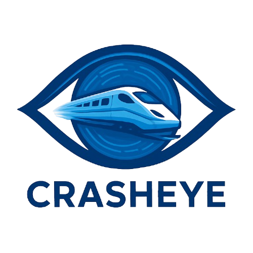
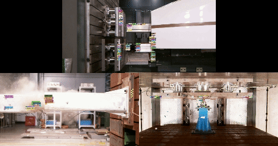
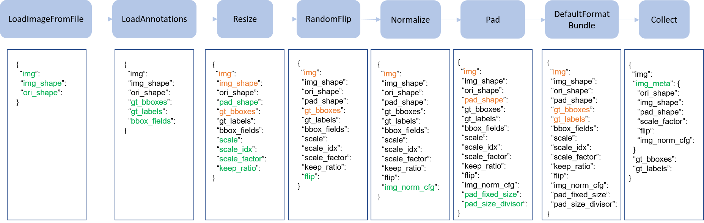
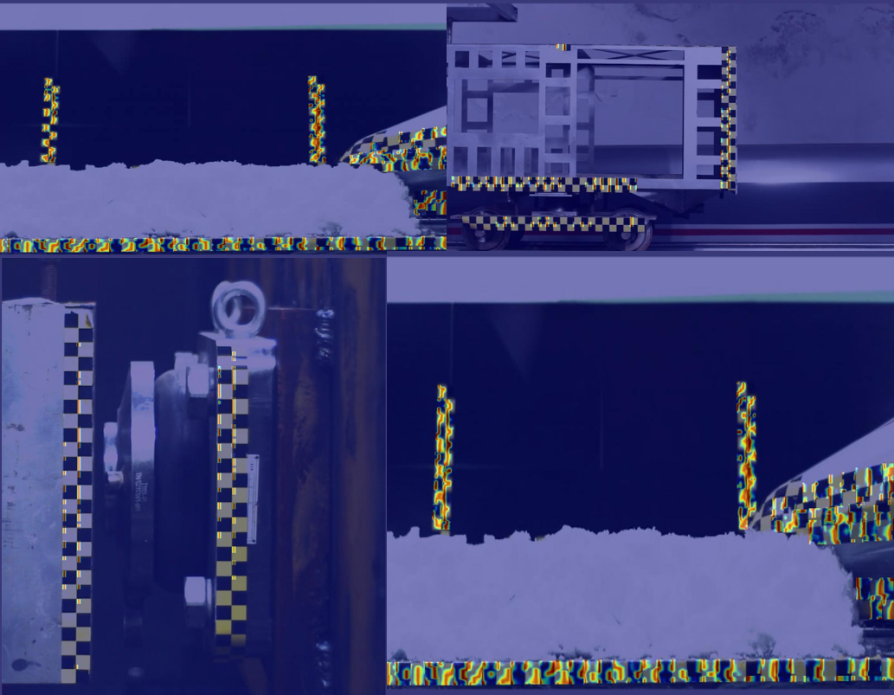

<div align="center">
  
  <div>&nbsp;</div>
</div>

<div align="center">

[English](README.md) | 简体中文

</div>

## 📖 目录
- [简介](#简介)
- [新闻](#新闻)
- [安装](#安装)
- [数据准备](#数据准备)
- [模型库](#模型库)
- [运行说明](#运行说明)
- [案例](#案例)
- [注意事项](#注意事项)
- [致谢](#致谢)
- [许可证](#许可证)

## 新闻
- **⭐2025-09-08**  
  - 初始版本 `CrashEye` 发布，支持列车碰撞序列图像自主感知。  
  - 提供 `Crash2024` `Crash-ReID` `Crash-Seq` 数据集接口。
  - 提供各个模型预训练权重，包括检测以及Re-ID。 

## 简介
[CrashEye](https://github.com/YanJieWen/CrashEye)是第一个面向**列车耐撞性**设计的目标检测+跟踪项目。它可以在无需任何人工干预的情况下实现列车碰撞过程中的棋盘导航点的自主轨迹提取。

主分支代码目前在``Pytorch 2.0`` ``Python 3.8`` ``CUDA 11.8``版本上运行。  

- **集成多个检测/跟踪架构**

CrashEye集成的检测器包括[MMdetection](https://github.com/open-mmlab/mmdetection)/[ultralytics](https://github.com/ultralytics/ultralytics)/强基线[CVMR](https://github.com/YanJieWen/CVMR)。
跟踪器包括[MMTracking](https://github.com/open-mmlab/mmtracking)/强基线[MASORT](https://github.com/YanJieWen/MASORT)。另外，我们的强基线还包括一个自监督的Re-ID模块[LWTGPF](https://github.com/YanJieWen/LWTGPF-2025)。
开发人员可以组合不同的组件和模块来自定义模型。  


- **多场景适应性**

CrashEye在多源碰撞场景中是有效的，包括端部吸能碰撞，整车碰撞，缩比列车碰撞等。  
<div align="center">

</div>

- **速度快**

所有的操作（检测/跟踪）均在强大的GPU上（```RTX4090@24G```）实现。借助既有的数据处理流水线，无需对高速摄影仪（HS2C）采集的高分辨率图像进行处理，而是通过缩放操作来显著降低显存。  
<div align="center">

</div>

- **性能高**

CrashEye包含一个强基线模型，采用[CVMR](https://github.com/YanJieWen/CVMR)来实现小目标检测，[LWTGPF](https://github.com/YanJieWen/LWTGPF-2025)进行实例的深度外观特征提取，[MASORT](https://github.com/YanJieWen/MASORT)对目标进行跨帧的自适应跟踪。各基线的性能均在项目库中进行报告。

## 安装  

### 1. 安装CrashEye
```shell
git clone  https://github.com/YanJieWen/CrashEye.git
cd CrashEye
python setup.py develop
```
### 2. 安装[openmmlab](https://mmdetection.readthedocs.io/zh-cn/latest/get_started.html)基线库  
```shell
pip install -U openmim
mim install mmengine
```
- **安装mmcv**
mmdet与mmcv的版本需要对齐，[参考此处](https://github.com/open-mmlab/mmtracking/blob/master/docs/zh_cn/install.md)。对于[mmcv](https://github.com/open-mmlab/mmcv)可采用轮子下载，参考列表在[此处](https://download.openmmlab.com/mmcv/dist/cu118/torch2.0/index.html)

[](https://drive.google.com/drive/folders/1pAr4dmMDkEW2Wvl4af2sknU2GPN2856S?usp=sharing)

```shell
mim install mmcv_full-1.7.2-cp38-cp38-manylinux1_x86_64.whl
```
- **安装mmdetection**
```shell
cd modeling
cd mmdetection
%git checkout tags/v2.28.0
pip install -v -e .
python setup.py install
cd ..
```
- **安装mmtracking**
```shell
git clone https://github.com/open-mmlab/mmtracking.git
cd mmtracking
git checkout tags/v0.14.0
pip install -v -e .
python setup.py  install
cd ..
```
### 3. 安装Ultralytics  

- **安装CVMR**
```shell
git clone https://github.com/YanJieWen/CVMR.git
cd CVMR
```
- **安装[Casual Conv1D](https://github.com/Dao-AILab/causal-conv1d/releases)和[SSM](https://github.com/state-spaces/mamba/releases)算子**

[](https://drive.google.com/drive/folders/1pAr4dmMDkEW2Wvl4af2sknU2GPN2856S?usp=sharing)
[](https://drive.google.com/drive/folders/1pAr4dmMDkEW2Wvl4af2sknU2GPN2856S?usp=sharing)

```shell
pip install causal_conv1d-1.4.0+cu118torch2.0cxx11abiFALSE-cp38-cp38-linux_x86_64.whl
pip install mamba_ssm-2.2.2+cu118torch2.0cxx11abiFALSE-cp38-cp38-linux_x86_64.whl
pip install --upgrade pip
pip install -v -e .
cd .. 
```
- **修改源码**

将modeling/CVMR/ultralytics/engine/validator.py 第`113`行强制半精度注释 （在某些情况下训练可能导致Nan）

### 4. 安装MASORT及其外部库

```shell
cd MASORT
python setup.py develop
```

### 5. 下载external库，可参考[MASORT](https://github.com/YanJieWen/MASORT)

```shell
cd external
git clone https://github.com/JonathonLuiten/TrackEval.git
cd TrackEval
pip install -v -e .
cd ..

git clone https://github.com/KaiyangZhou/deep-person-reid.git
cd deep-person-reid
pip install -r requirements.txt
python setup.py develop
cd ..

git clone https://github.com/JDAI-CV/fast-reid.git

```

### 6. 其他库安装

```shell
pip install faiss-gpu
pip install emoji
pip install openpyxl
pip install loguru
pip install thop
pip install filterpy
pip install scikit-learn
pip install grad-cam==1.4.8
pip install timm

```

## 数据准备  

CrashEye开发了全球首套面向列车碰撞的基准，包括检测数据集`Crash2024`, `Crash-Seq`以及`Crash-ReID`。所有数据按照要求提供。

<div align="center">

| 数据类型 | 名称| 下载地址 | 存放地址 |
| ---------- | ---------- | ----------------------- | -------------------------------------------- |
| 检测| Crash2024 | [data](https://drive.google.com/drive/folders/1BJOdywj-hgXRKt_q0TEcBGpCV4Wojmhc?usp=drive_link) | **datasets** |
| 重识别 | Crash-ReID | [data](https://pan.baidu.com/s/17e5o7nZqMTBO0WxoDDfZvA?pwd=ks5f) | **datasets**|
| 跟踪 | Crash-Seq | [data]( https://pan.baidu.com/s/1FyOSl3A43Cibm6zxXlGYbA?pwd=gpju) | **datasets** |

</div>

## 模型库  
CrashEye在[configs](configs)中提供了``7``个案例，它们涵盖了纯openmmlab方法，纯ultralytics方法以及混合方法。也就是说，开发人员可以通过修``yaml``文件来搭建任意的模型。``需要注意的是，需要提供模型的预训练模型``:  
<div align="center">  

| 检测 | 跟踪 | 模型 | 配置文件 | 存放地址 |
| ---------- | ---------- | --------------------------------------------------------------------------- | -------------------------------------------- | -------------------------------------------- |
| Centernet | MASORT | model[[baidu:csuw]](https://pan.baidu.com/s/1YjfNrMjzZW8y4461-lIKew) | [config](configs/mix_crash_centernet_masort.yaml) | **pretrained/det** |
| YOLOv8 | Deepsort | model[[baidu:csuw]](https://pan.baidu.com/s/1YjfNrMjzZW8y4461-lIKew) | [config](configs/mix_crash_yolov8s_deepsort.yaml) | **pretrained/det** |
| Centernet | Deepsort | model[[baidu:csuw]](https://pan.baidu.com/s/1YjfNrMjzZW8y4461-lIKew) | [config](configs/mm_crash_centernet.yaml) |**pretrained/det** |
| Faster-RCNN | Deepsort | model[[baidu:csuw]](https://pan.baidu.com/s/1YjfNrMjzZW8y4461-lIKew) | [config](configs/mm_crash_frcnn.yaml)  | **pretrained/det** |
| YOLOX | ByteTrack | model[[baidu:csuw]](https://pan.baidu.com/s/1YjfNrMjzZW8y4461-lIKew) | [config](configs/mm_crash_yolox.yaml)  | **pretrained/det** |
| CVMR | MASORT | model[[baidu:csuw]](https://pan.baidu.com/s/1YjfNrMjzZW8y4461-lIKew) | [config](configs/ult_crash_cvmrs.yaml)  | **pretrained/det** |
| YOLOv8s | MASORT | model[[baidu:csuw]](https://pan.baidu.com/s/1YjfNrMjzZW8y4461-lIKew)| [config](ult_crash_yolov8.yaml)  |  **pretrained/det** |

</div>

另外，CrashEye还提供了面向行人和碰撞场景的Re-ID预训练模型:  

<div align="center">  
  
| 数据集 | 模型 | 存放地址 |
| ---------- | ---------------------------------------------------------------------------| ---------------------------  |
| MOT17-val | model[[baidu:csuw]](https://pan.baidu.com/s/1Mhbw2E4KPvz704OaAloe5A) | **pretrained/reid** |
| MOT17-test | model[[baidu:csuw]](https://pan.baidu.com/s/1Mhbw2E4KPvz704OaAloe5A) | **pretrained/reid** |
| MOT20 | model[[baidu:csuw]](https://pan.baidu.com/s/1Mhbw2E4KPvz704OaAloe5A) | **pretrained/reid** |
| DanceTrack | model[[baidu:csuw]](https://pan.baidu.com/s/1Mhbw2E4KPvz704OaAloe5A) | **pretrained/reid** |
| Crash-Seq | model[[baidu:csuw]](https://pan.baidu.com/s/1Mhbw2E4KPvz704OaAloe5A) | **pretrained/reid** |  

</div>  

## 运行说明

CrashEye提供了一个最小示例来展示如何运行本项目。本运行案例源自[CVMR+MASORT](configs/ult_crash_cvmrs.yaml)。  
[](https://pan.baidu.com/s/1tltqqGCQHEANv9VeJbWs-w?pwd=4bjh)  

将上述训练好的权重文件夹命名为`cvmr-s-1440`并将其放入`modeling/CVMR/runs`路径下  


- **准备工作**

CrashEye遵循大部分跟踪器的训练方式，采用混合训练的方式。先将Crash-Seq转为COCO格式
```shell
python tools/convert_crash_to_coco.py
```
在混合数据前，可能还需要创建图像目录的软链接，可以参考[mix](tools/mix_data_crash_ablation.py)的抬头。 
```shell
python tools/mix_data_crash_ablation.py
```
对于YOLO数据集，可能需要对COCO数据进行进一步转换，执行[代码](tools/convert_coco_to_yolo.py)并将数据移动至`CVMR/datasets`路径下
```shell
python tools/convert_coco_to_yolo.py
mkdir -p modeling/CVMR/datasets/crash
```
- **训练模型**

```shell
python tools/ult_train.py --config configs/ult_crash_cvmrs.yaml
```
- **评估模型**

```shell
python tools/ult_val.py --config configs/ult_crash_cvmrs.yaml
```

- **模型分析**

CrashEye可以输出热图，COCO格式预测结果，PR曲线结果。
```shell
python tools/ult_ana.py --config configs/ult_crash_cvmrs.yaml
```
分析的结果以及`log` 文件被存储在`runs/ult_cvmr-s_crash/analysis`   

<div align="center">
  
  <div>&nbsp;</div>
</div>

- **跟踪评估**

```shell
python tools/track.py --config configs/ult_crash_cvmrs.yaml
```
类似地，跟踪结果被保存至`runs/ult_cvmr-s_crash/analysis`文件夹下。


## 案例 
CrashEye仅需要一行代码即可实现对任意列车碰撞场景的持续跟踪
```shell
python tools/demo.py -c configs/ult_crash_cvmrs.yaml -d demo/demo02.avi
```
结果可以在`runs/ult_cvmr-s_crash/demo`文件夹下查看。更重要的是，我们还提供了一个线性插值[方法](utils/interpolation.py)来填充由于遮挡导致的轨迹丢失，生成的跟踪结果名为`data_dti.txt`   

<div align="center">
  
  <div>&nbsp;</div>
</div>


## 注意事项  

- 	⚠️在调用`TrackEval`评估HOTA时，可能**numpy**版本错误，需要对numpy进行版本调整
- 	⚠️基于mmdetection构建新模型时，需要重新编译``python setup.py install``
-   ⚠️模型训练的分辨率为800x1440，开发人员需要精心调整分辨率来保证最优结果
-   ⚠️对于**MASORT**，可能需要精心调整`alpha_gate`和`appear_thresh`参数来获得最优跟踪结果
-   ⚠️CrashEye提供的强基线有望解决远距离低帧率HS2C或者近距离高帧率HS2C，但无法解决远距离低帧率双重难点，这也是我们未来的工作重心


## 致谢

我们非常感谢开源工作社区提供的坚实代码基础：
- 	🙏[mmdetection](https://github.com/open-mmlab/mmdetection)
- 	🙏[mmtracking](https://github.com/open-mmlab/mmtracking)
- 	🙏[ultralytics](https://github.com/ultralytics/ultralytics)
- 	🙏[ByteTrack](https://github.com/FoundationVision/ByteTrack)
- 	🙏[TOPIC](https://github.com/holmescao/TOPICTrack)
- 	🙏[RFLA](https://github.com/Chasel-Tsui/mmdet-rfla)

我们承诺会对[CrashEye](https://github.com/YanJieWen/CrashEye)进行长期维护，更多问题欢迎咨询obitowen@csu.edu.cn  


## 许可证 
[MIT](LICENSE) © YanjieWen


